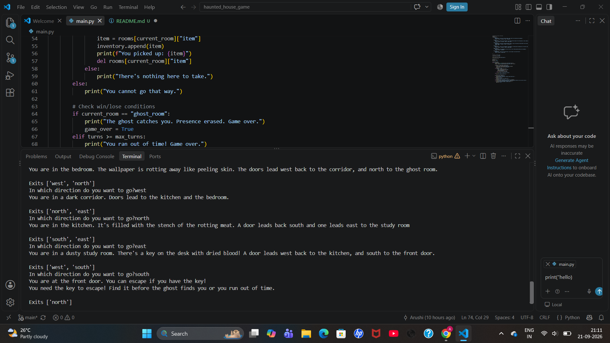
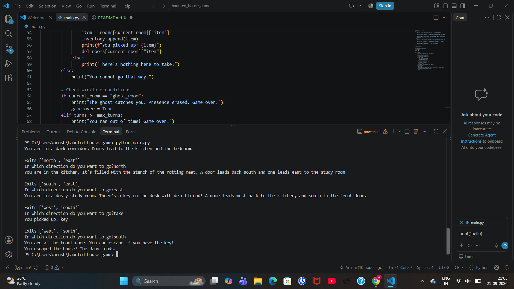
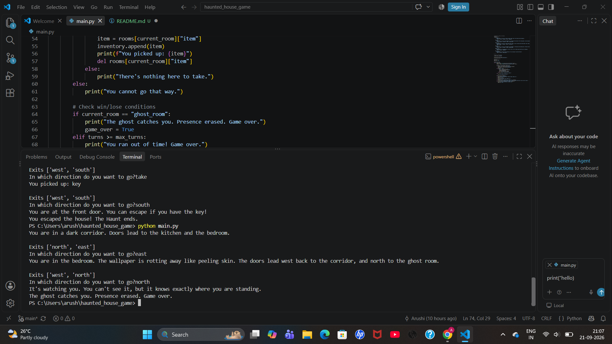

# Haunted House - An Escape Game

## Description
A Python game in which the player must escape a haunted house before running out of turns or getting caught by the ghost.

## Features
- Room to room exploration using simple commands.
- Inventory system to pick up and use items i.e. a key
- Limited number of turns with a 'ghost room'.
- Win and lose conditions: escape the house, caught by the ghost or run out of turns.

## Stack Built
- Python 3

## How to Install and Run
1. Clone this repository:
```
git clone https://github.com/arushi26mib10096-design/haunted-house-game.git
```
2. Navigate to the folder:
```
   cd haunted-house-game
```
3. To run the game:
python main.py

## Instructions on how to play
- Type a direction (`north`, `south`, `east`, `west`) to move back and forth between the rooms.
- Type `take` to pick up an item in the current room.
- To escape the house, reach the front door with the key.
- Avoid the ghost room, and escape before running out of turns (maximum turns = 10).

## Instructions for testing the program
- When reaching the front door without the key, the game will tell that you need the key to escape.
- On entering the ghost room, the game will end immediately.
- On wandering for 10 turns without escaping, the game will due to running out of time.
- When trying an invalid direction, the game will say you cannot go that way.

## Screenshots

### Exploring the house


### Picking up the key


### Ghost ending
